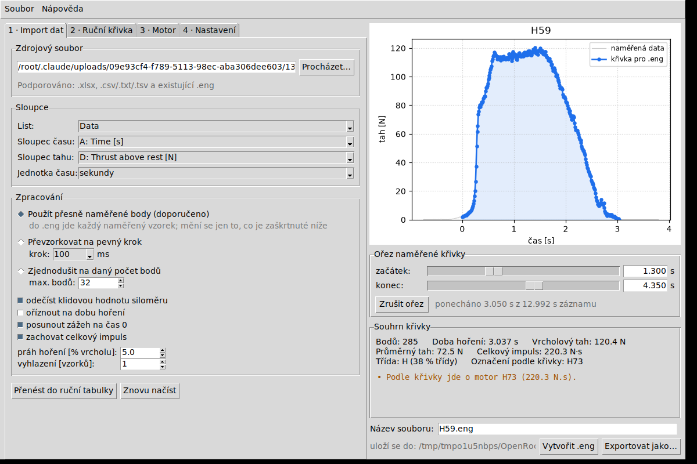

# Generátor motorových souborů `.eng` pro OpenRocket

Aplikace s jednoduchým grafickým rozhraním (česky), která ze změřených dat
statického testu nebo z ručně zadané tahové křivky vytvoří motorový soubor
`.eng` pro **OpenRocket** i **openMotor**.



## Co program umí

* **Import naměřených dat** z `.xlsx`, `.csv`, `.txt`, `.tsv` nebo z existujícího `.eng`.
  Sloupce času a tahu se rozpoznají samy (včetně milisekund), lze je i přepnout ručně.
  Ze souhrnného listu se předvyplní název motoru a hmotnost paliva, pokud tam jsou.
* **Zpracování surového záznamu**: odečtení klidové hodnoty siloměru, ořez na dobu
  hoření (práh v % vrcholu, krátké špičky ze zážehové linky se ignorují), posun
  zážehu na čas 0, vyhlazení a dorovnání celkového impulsu.
* **Naměřená data se přebírají přesně** – do `.eng` jde každý vzorek se svým časem,
  nic se nepřevzorkovává. Volitelně (druhá a třetí volba v sekci *Zpracování*) lze
  záznam převzorkovat na pevný krok 100–1000 ms nebo zjednodušit na zvolený počet
  bodů se zachováním tvaru křivky – například když má být soubor menší.
* **Ruční tvorba křivky**: krokování po 100, 200, …, 1000 ms slouží právě tady –
  zvolíte krok a dobu hoření, vytvoří se mřížka a tah v newtonech se zapisuje
  dvojklikem přímo do tabulky.
* **Ruční ořez importované křivky** – dvěma posuvníky pod grafem (nebo zapsáním
  časů) zkrátíte záznam zleva i zprava přesně tam, kam chcete. Graf se překresluje
  během tažení a šedě ukazuje i kousek toho, co ořez ubral.
* **Živý graf** – při každé úpravě se překreslí; na pozadí je šedě vidět původní
  naměřený průběh.
* **Souhrn křivky**: doba hoření, vrcholový a průměrný tah, celkový impuls, třída
  motoru a označení (např. `H81`).
* **Přednastavení motoru** – název, výrobce, průměr, délka, zpoždění a hmotnosti se
  dají uložit pod jménem a příště jedním kliknutím načíst.
* **Zapamatovaná výstupní složka** – výchozí je
  `%APPDATA%\OpenRocket\ThrustCurves`, lze ji změnit a volba platí i po zavření
  programu.
* **Kontrola před uložením** – prázdný název, nesmyslné rozměry, klesající čas,
  záporný tah nebo nenulový poslední bod se ohlásí dřív, než soubor vznikne.

## Spuštění

Potřebujete Python 3.9 nebo novější (na Windows stačí instalátor z python.org,
`tkinter` je jeho součástí).

```
python eng_generator.pyw
```

Ve Windows lze soubor `eng_generator.pyw` spustit i dvojklikem – otevře se rovnou
okno aplikace bez černé konzole.

Volitelně:

```
pip install matplotlib
```

Matplotlib dělá graf hezčí. Když nainstalovaný není, program kreslí vlastní
zjednodušený graf a funguje dál – žádná další knihovna není potřeba.

## Postup práce

1. **Import dat** – vyberte soubor a zkontrolujte sloupce. Ve výchozím nastavení
   se použijí přesně naměřené body; převzorkování na pevný krok je jen volitelná
   možnost. Posuvníky *Ořez naměřené křivky* pod grafem záznam zkrátíte na tu
   část, kterou chcete mít v souboru.
2. **Ruční křivka** – nebo si křivku naklikejte sami: krok, doba hoření,
   *Vytvořit mřížku* a pak dvojklikem hodnoty tahu. Tlačítko *Přenést do ruční
   tabulky* umožní doladit i importovaná data.
3. **Motor** – vyplňte název, výrobce, průměr, délku, zpoždění a hmotnosti
   (v gramech). *Uložit jako…* si kombinaci zapamatuje jako přednastavení.
4. **Nastavení** – zvolte složku, kam se `.eng` ukládá.
5. **Vytvořit .eng** – program soubor zkontroluje, uloží a řekne kam.

OpenRocket načítá tahové křivky při startu, takže po vytvoření souboru ho
restartujte.

## Formát výstupu

```
; poznámka
Gragas_40mm 43.4 167.0 P 0.1660 0.3750 CRS
   0 0
   0.25 18
   ...
   3.6 0
;
```

Hlavička je standardní RASP: název, průměr [mm], délka [mm], zpoždění,
hmotnost paliva [kg], celková hmotnost [kg], výrobce. Diakritika se do souboru
zapisuje bez háčků a čárek, aby ho spolehlivě přečetly i starší programy.

## Struktura projektu

| Soubor | Obsah |
| --- | --- |
| `eng_generator.pyw` | spouštěč aplikace |
| `engine_generator/gui.py` | okno, záložky a obsluha tlačítek |
| `engine_generator/curve.py` | zpracování naměřené křivky (ořez, převzorkování, redukce) |
| `engine_generator/engfile.py` | čtení a zápis `.eng`, výpočty impulsu a třídy, kontroly |
| `engine_generator/dataimport.py` | čtení `.xlsx` a textových dat bez dalších knihoven |
| `engine_generator/config.py` | trvalé nastavení a přednastavení motorů |
| `engine_generator/plot.py` | graf (matplotlib, se záložním vykreslením na plátno) |
| `tests/test_core.py` | testy jádra bez GUI |

Nastavení a přednastavení se ukládají do
`%APPDATA%\OpenRocketEngineGenerator\` (na Linuxu a macOS do obdobné složky).

## Testy

```
python -m unittest discover -s tests
```
